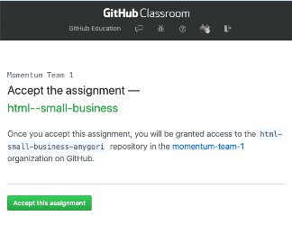

## Today's topics

- Learn about HTML tags and elements
- Create a page with HTML

## Intro to GitHub Classroom

We are using a tool called GitHub classroom to generate a repository (repo) on GitHub for each student to work in.

Each day we will share an assignment invitation here on this page. Clicking on the link will take you to a page where you will see as message that looks something like this:

You'll see your github username as part of the repo name instead of `amygori`. When you accept the assignment, GitHub will create your homework repo and, when it is done, give you a link to it (from now on, this is the link you will use to see your project on GitHub, NOT the assignment invitation link). Go to that newly created repo and click on the green button to "Clone or download" your repo. This will copy the repo's url to your clipboard.

In your terminal, navigate to the folder where you intend to keep your projects. When you are in the directory you want to be in, type `git clone <url-for-your-repo>`, but in place of <url-for-your-repo>, paste in the url you copied from GitHub. You'll see output indicating the repo is being cloned. When it's done, you can `cd` into it and type `git status` to see that you are in a git repo. Open this repo in VS Code (an easy way to do this is to type `code .` when you are in the assignment repo) and do your work here. Add and commit in the terminal as you work.

## Project
### Build a Small Business Website

[Link to the assignment invitation](https://classroom.github.com/a/M8LGC-69)

### Links from class

- [MDN Getting Started with HTML](https://developer.mozilla.org/en-US/docs/Learn/HTML/Introduction_to_HTML/Getting_started)
- [MDN HTML Resources Page](https://developer.mozilla.org/en-US/docs/Web/HTML)
- [A Brief History of Markup](https://alistapart.com/article/a-brief-history-of-markup/)
- [A short history of the web](https://docs.google.com/document/d/17lCHxlyLCVi8glSnkfwlIbs4oCLHEQTAIWEBxXOI1ko/edit)
- [Asking technical questions: Your Brain's API](https://www.youtube.com/watch?v=hY14Er6JX2s)
- [class slides PDF](../slide-decks/html-slides.pdf)
