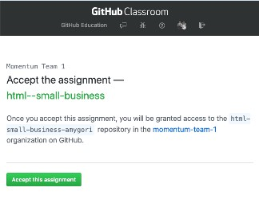

## Today's topics

- Daily, weekly, program schedule
    - Daily schedule - questions due by 1:30pm, minimum 2 per week - [Question form](https://forms.gle/wfpHhXJeLeGWEpqr5)
    - [Weekly schedule](https://docs.google.com/document/d/1apIC8E3YPh2lOxnn_jPrPf3FbenD68GfK8Wh7wr_Xa0/edit?usp=sharing)
    - [Program schedule-subject to change](https://docs.google.com/document/d/1oFUW8xmt4MZFyJN38GLqebsvJy-BmIkX8OiGGov_M2E/edit?usp=sharing)
- Learn about HTML tags and elements
- Create a page with HTML

### Intro to Google Classroom and GitHub Classroom

Class assignments, grades, and quizzes can be found in [Google Classroom](https://classroom.google.com/c/MTQzODg3MTY4MzI3?cjc=h7y5cu4). 

Each day we will share a link to the assignment here on this page. Fridays the link will be to a quiz. For most of the homework assignments, we are using a tool called GitHub classroom to generate a repository (repo) on GitHub for each student to work in. Clicking on the link in the assignment will take you to a page where you will see as message that looks something like this:

You'll see your github username as part of the repo name instead of `amigori`. When you accept the assignment, GitHub will create your homework repo and, when it is done, give you a link to it (from now on, this is the link you will use to see your project on GitHub, NOT the assignment invitation link). Go to that newly created repo and click on the green button to "Clone or download" your repo. This will copy the repo's url to your clipboard.

In your terminal, navigate to the folder where you intend to keep your projects. When you are in the directory you want to be in, type `git clone <url-for-your-repo>`, but in place of <url-for-your-repo>, paste in the url you copied from GitHub. You'll see output indicating the repo is being cloned. When it's done, you can `cd` into it and type `git status` to see that you are in a git repo. Open this repo in VS Code (an easy way to do this is to type `code .` when you are in the assignment repo) and do your work here. Add and commit in the terminal as you work.

### Using VS Code

VS Code (or Visual Studio Code) is a text editor made by Microsoft. It is free and open source, and it's used by many professional developers these days.

If you haven't installed it yet, see the [Setting Up Your Computer Mac](https://drive.google.com/open?id=1ibV4dA4ciQsxn9MT7TV4-e_KgzUQwCQ7O1zEVfxy_28&authuser=1) or [Setting Up Your Computer Windows](https://docs.google.com/document/d/1OMtagvx9622O1tPf_ICdXXwUHyWwUShd9hgj1LeiFZg)instructions for how to do that.

See [Getting Started with VS Code](https://code.visualstudio.com/docs/introvideos/basics) for an overview and a video intro to using this tool.

### Project
#### Build a Small Business Website

[Link to the assignment invitation](https://classroom.github.com/a/M8LGC-69)

### Links from class

- [MDN Getting Started with HTML](https://developer.mozilla.org/en-US/docs/Learn/HTML/Introduction_to_HTML/Getting_started)
- [MDN HTML Resources Page](https://developer.mozilla.org/en-US/docs/Web/HTML)
- [A Brief History of Markup](https://alistapart.com/article/a-brief-history-of-markup/)
- [A short history of the web](https://docs.google.com/document/d/17lCHxlyLCVi8glSnkfwlIbs4oCLHEQTAIWEBxXOI1ko/edit)
- [Asking technical questions: Your Brain's API](https://www.youtube.com/watch?v=hY14Er6JX2s)
- [class slides PDF](https://drive.google.com/file/d/1bdE3zJk096xGwDoS9JoU4NygLa6nk0w6/view?usp=sharing)
- [example code from class: bears site](https://github.com/momentum-team-1/examples/tree/master/bears-html)
- [class video recording]
